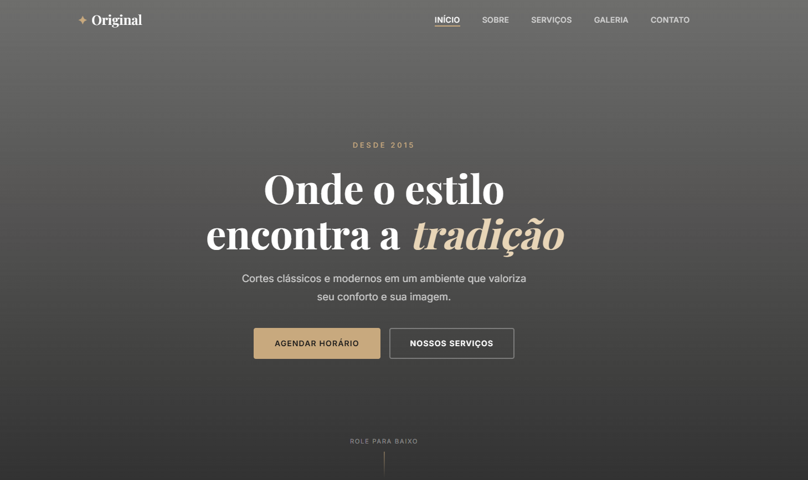

# 💈 Barbearia Original

Landing Page moderna para uma barbearia, desenvolvida com foco em design elegante, responsividade e experiência do usuário.




## 📖 Sobre o projeto

Este projeto foi criado para apresentar os serviços de uma barbearia de forma profissional, utilizando uma interface moderna e intuitiva.

A página conta com:

- ✅ Hero Section com chamada principal
- ✅ Navegação fixa
- ✅ Seção Sobre
- ✅ Serviços
- ✅ Galeria
- ✅ Contato
- ✅ Layout responsivo
- ✅ Animações suaves
- ✅ Design Premium

---

## 🚀 Tecnologias utilizadas

- HTML5
- CSS3
- JavaScript
- Google Fonts
- CSS Flexbox
- CSS Grid

---

## 📱 Responsividade

O projeto foi desenvolvido para funcionar em:

- Desktop
- Notebook
- Tablet
- Smartphone

---

## 📂 Estrutura do projeto

```text
📁 Barbearia
│
├── index.html
├── style.css
├── script.js
└── README.md
```

---

## ▶️ Como executar

Clone o repositório:

```bash
git clone https://github.com/emgamervendas-arch/Barbearia-2.git
```

Depois basta abrir o arquivo:

```text
index.html
```

ou utilizar a extensão **Live Server** no VS Code.

---

## 📸 Preview

Adicione uma captura da página e salve como:

```
preview.png
```

Assim ela aparecerá automaticamente no README.

---

## 🎯 Objetivo

Este projeto foi desenvolvido para praticar:

- Estruturação com HTML
- Estilização com CSS
- Manipulação do DOM com JavaScript
- Desenvolvimento de Landing Pages modernas
- Design responsivo

---

## 👨‍💻 Autor

**Thiago Pimentel**

GitHub:
https://github.com/emgamervendas-arch

LinkedIn:
https://www.linkedin.com/in/thiago-pimentel-de-miranda-812766376/

---

## 📄 Licença

Projeto desenvolvido para fins de estudo e portfólio.
